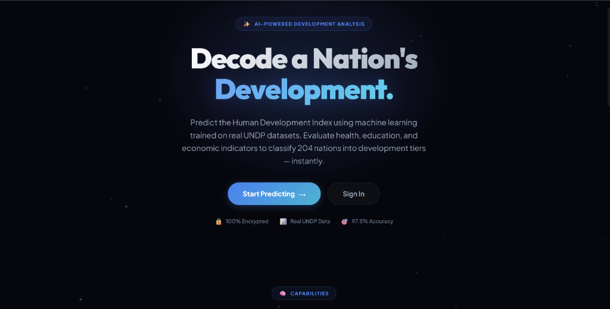

# 🌍 HDI Insight — Human Development Index Predictor

<div align="center">

# 🌍 HDI Insight

### AI-Powered Human Development Index Prediction Platform

Predict, analyze, and explore **Human Development Index (HDI)** scores using Machine Learning, AI, and interactive visualizations.

[](https://python.org)
[](https://fastapi.tiangolo.com)
[](https://react.dev)
[](https://nodejs.org)
[](https://mongodb.com)
[](https://fastapi.tiangolo.com)
[](https://scikit-learn.org)
[](https://stripe.com)
[](https://ai.google.dev)

<br>

## 🚀 Live Demo

### https://hdi-insight.onrender.com

</div>


<p align="center">

</p>


# 📖 About the Project

HDI Insight is a full-stack Machine Learning web application that predicts and analyzes the **Human Development Index (HDI)** of countries based on key socioeconomic indicators.

The application combines:

* 🤖 Machine Learning prediction
* 💬 Google Gemini AI chatbot
* 📊 Interactive analytics dashboard
* 🔐 Secure authentication
* 💳 Stripe payment integration
* 📜 Prediction history
* 📰 Educational development blog

Users can enter country statistics and instantly receive:

* HDI Score
* Development Category
* AI-generated Policy Recommendations
* Personalized Insights

---

# 🌍 What is HDI?

The **Human Development Index (HDI)** is a composite statistic developed by the **United Nations Development Programme (UNDP)** to measure a country's level of human development.

It evaluates three major dimensions:

❤️ **Health**

* Life Expectancy at Birth

🎓 **Education**

* Mean Years of Schooling
* Expected Years of Schooling

💰 **Standard of Living**

* Gross National Income (PPP) per Capita

Countries are classified into four development categories:

🟢 Very High

🟡 High

🟠 Medium

🔴 Low

---

# ✨ Features

* 🤖 AI-powered HDI Prediction
* 📊 Interactive Dashboard
* 💬 Google Gemini AI Chatbot
* 📜 Prediction History
* 🔐 JWT Authentication
* 🔒 Password Encryption using bcrypt
* 💳 Stripe Credit System
* 📰 Development Blog
* 📱 Fully Responsive Design
* ⚡ FastAPI ML Microservice
* ☁ MongoDB Cloud Storage

---

# 🏗️ System Architecture

```
                    User
                      │
                      ▼
            React + Vite Frontend
                      │
                 REST API
                      │
                      ▼
            Node.js + Express Backend
             │                  │
             ▼                  ▼
       MongoDB Atlas       Stripe API
             │
             ▼
        FastAPI ML Service
             │
             ▼
 Random Forest Prediction Model
```

---

# 🛠️ Tech Stack

## Frontend

* React
* Vite
* React Router DOM
* Axios
* Lucide React

---

## Backend

* Node.js
* Express.js
* MongoDB
* Mongoose
* JWT
* bcryptjs
* Stripe API

---

## Machine Learning

* Python
* FastAPI
* Scikit-learn
* Pandas
* NumPy
* Joblib

---

## AI

* Google Gemini API

---

# 📂 Project Structure

```
hdi-insight/
│
├── assets/
│
├── frontend/
│   ├── src/
│   │   ├── components/
│   │   ├── pages/
│   │   ├── services/
│   │   └── assets/
│   └── public/
│
├── backend/
│   ├── controllers/
│   ├── middleware/
│   ├── models/
│   ├── routes/
│   ├── utils/
│   └── server.js
│
└── ml-engine/
    ├── api/
    ├── data/
    ├── models/
    ├── src/
    └── requirements.txt
```

---

# 🚀 Installation

## Clone Repository

```bash
git clone https://github.com/YOUR_GITHUB_USERNAME/hdi-insight.git

cd hdi-insight
```

---

## 1️⃣ Setup ML Engine

```bash
cd ml-engine

python -m venv venv
```

Activate

Windows

```bash
.\venv\Scripts\activate
```

Linux/macOS

```bash
source venv/bin/activate
```

Install

```bash
pip install -r requirements.txt
```

Run

```bash
uvicorn api.main:app --reload --host 127.0.0.1 --port 8000
```

---

## 2️⃣ Setup Backend

```bash
cd backend

npm install
```

Create `.env`

```env
PORT=5000

MONGO_URI=your_mongodb_uri

JWT_SECRET=your_secret

STRIPE_SECRET_KEY=your_key

STRIPE_WEBHOOK_SECRET=your_secret

GEMINI_API_KEY=your_key

ML_API_URL=http://127.0.0.1:8000

FRONTEND_URL=http://localhost:5173
```

Run

```bash
npm run dev
```

---

## 3️⃣ Setup Frontend

```bash
cd frontend

npm install
```

Create `.env`

```env
VITE_API_URL=http://localhost:5000/api
```

Run

```bash
npm run dev
```

Visit

```
http://localhost:5173
```

---

# 🔌 API Endpoints

| Method | Endpoint                                | Description             |
| ------ | --------------------------------------- | ----------------------- |
| POST   | `/api/auth/register`                    | Register User           |
| POST   | `/api/auth/login`                       | Login                   |
| POST   | `/api/predict`                          | Predict HDI             |
| GET    | `/api/history`                          | User Prediction History |
| POST   | `/api/chat`                             | AI Chatbot              |
| POST   | `/api/payments/create-checkout-session` | Stripe Checkout         |
| GET    | `/api/payments/verify-session`          | Verify Payment          |
| GET    | `/api/blog`                             | Fetch Blogs             |

---

# 🧠 Machine Learning Model

### Algorithm

✅ Random Forest Regressor

### Input Features

* Life Expectancy
* Mean Years of Schooling
* Expected Years of Schooling
* Gross National Income (PPP)

### Output

* HDI Score
* Development Category
* Policy Recommendations

---

# 🚀 Future Enhancements

* 🌍 Country Comparison
* 📈 HDI Trend Forecasting
* 🗺 Interactive World Map
* 📄 PDF Report Export
* 📊 Advanced Analytics
* 🌐 Multi-language Support
* 📱 Mobile Application

---

# 🤝 Contributing

Contributions are welcome!

1. Fork the repository

2. Create a new branch

```bash
git checkout -b feature-name
```

3. Commit changes

```bash
git commit -m "Added new feature"
```

4. Push

```bash
git push origin feature-name
```

5. Open a Pull Request

---


# 👨‍💻 Author

## Shaik Abdul Hanif

**Full Stack Developer | MERN Stack | Machine Learning | Java**

### GitHub

https://github.com/SHAIKHANIF2004

### LinkedIn

https://www.linkedin.com/in/abdulhanifshaik

---

<div align="center">

### ⭐ If you found this project helpful, consider giving it a Star!

Made with ❤️ by **Shaik Abdul Hanif**

</div>
